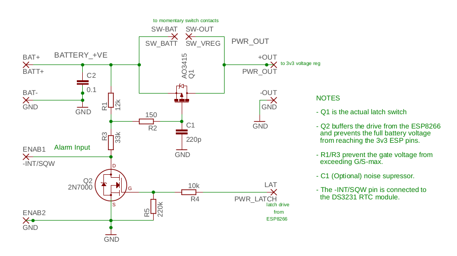

# ESP8266-DS3231
### Using a DS3231 to control power to an ESP8266 ("no-power" deep sleep)

Uses the interrupt (alarm) from a DS3231 RTC chip to turn on a P-channel MOSFET, which supplies power to the ESP8266.

The ESP8266 reads the time and temperature from the DS3231 (and optionally does something useful with it), calculates the timing of the next wake-up call and loads it back to the DS3231 register, causing the DS3231 to turn off the power and send everything back into no-power sleep mode.  The DS3231 at this point is sipping power from it's own coin-cell back-up battery.

Rinse and repeat.

#### Hardware Notes

The switch connections shown at the top of the board are there to enable a push-button switch to be added to the project for development and updating (otherwise you have to wait for the DS3231 to wake up the ESP8266 before you can update the firmware).

The 2N7000 N-channel MOSFET is there to protect the ESP8266 (a 3v3 device) against the high battery voltage present at the lower end of the R1/R3 resistor chain when the ESP8266 is off (which is most of the time).  Yes, I know that it presents a very small current and that many people claim that the ESP8266 is 5v tolerant anyway, but this is belt-and-braces protection for something which is projected to have a long usage life (a version of this has been running for many years now as a single-button remote on/off switch for our ancient television -- and it gets more than two years of battery life while still being used a minimum of six times per day and despite having multiple blinkenlights to help diagnose any problems).

The R1/R3 resistor pair were sized to prevent an excessively low gate voltage on the AO3415 P-MOSFET.  You might need to change these values if you replace that device with some other type.

The pads labelled ENAB1/ENAB2 on the bottom left are the connections from the DS3231, which switch the power to the ESP8266 "on" when the DS3231 timer expires and the -INT signal goes low.  The DS3231 doesn't require a positive supply from the ESP8266 side of the power switch, as it is modified to run *only* from the attached CR2032 coin-cell battery (see the photo of the DS3231 below, which has pin-2 VCC cut and wired to ground).  If you want to use the 4kB AT24C32 EEPROM on the DS3231 board, you can connect the 3v3 line to the DS3231 module and it will work quite happily (note that when the ESP8266 shuts down, so does the AT24C32, which is normally what you want ...but the DS3231 still ticks along quite happily on it's own coin-cell battery).

#### The DS3231 Module

As you can see from this image, pin-2 (VCC) of the DS3231 has been disconnected from the PCB and connected to ground, so the chip *cannot* get its positive supply voltage from the main project battery (whether the P-MOSFET switch is on or off) and therefore operates permanently on current supplied by the coin-cell battery. Other modifications include the removal of the current limiting resistor to permanently disable the power-on LED and the removal of the "charge" resistor to prevent any chance of the non-chargable CR2032 bursting. This particular module also has a ceramic capacitor across the battery, which can retain time settings while the battery is changed.

For tons of useful information on these DS3231 modules and specifically on these modifications for low power operation, see [Ed Mallon's "Cave Pearl Project"](https://thecavepearlproject.org/2014/05/21/using-a-cheap-3-ds3231-rtc-at24c32-eeprom-from-ebay/).

#### Software Notes
(Currently) Requires:- https://github.com/rodan/ds3231
 
Note that other (parallel) projects using this hardware are now using the Adafruit RTClib library and this project will be updated to reflect that in the very near future [written Feb 2022].

### Credits

A few years back, Brian Robbins (https://github.com/bprobbins) very kindly provided a schematic and what looks like a readily available, modern P-MOSFET type for the actual power-switching circuit (it would probably only have taken me about another 8 or 9 years to get around to it).  Check under the "Issues" menu above and scroll down to the -second- schematic.  Thanks, Brian!

...and yes, it did take me years, but Brian's (great!) schematic has now been supplemented with one to make it a little clearer where the physical connections fit together.  There's also an early (but working) version of the PCB for this circuit available from [OSH Park's shared-projects](https://oshpark.com/shared_projects/iFWjTLa5) area.  This is a mainly through-hole component board, with the single exception of the P-channel MOSFET, which is a surface-mount (but not too difficult to solder with a normal iron). Sometime in the next 10 or so years, I might get around to updating this board to a more useful form-factor (the prototype was sized to fit into the space along the top of the battery compartment in a dollar-store LED light, to make the very useful one-button remote control mentioned above). 

  
More recently, Moritz Mueller [Meins321] went to the trouble of forking the repository and sending a pull request, for which I thank him very much.  Unfortunately, the patch was actually for the Rodan DS3231 library, not for the code here.  However, Moritz did prompt me (through guilt) to finally upload the schematic for the switch and update this README.  Thanks Moritz!

